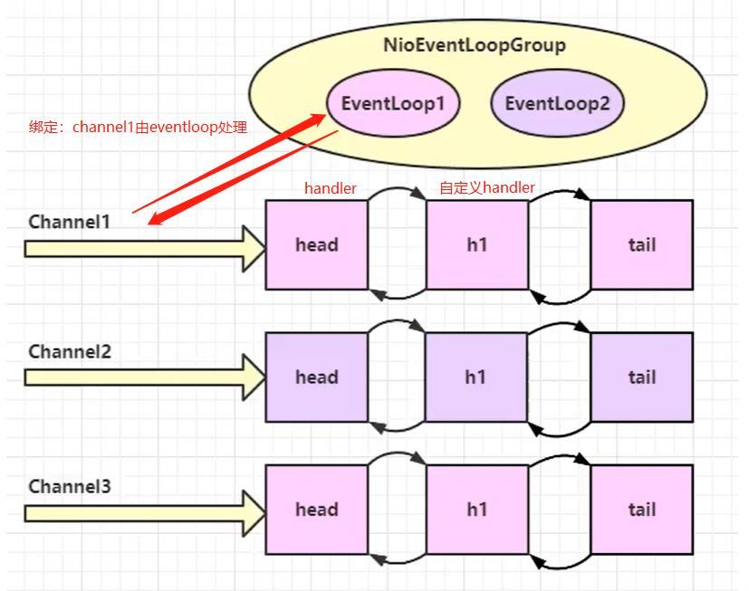
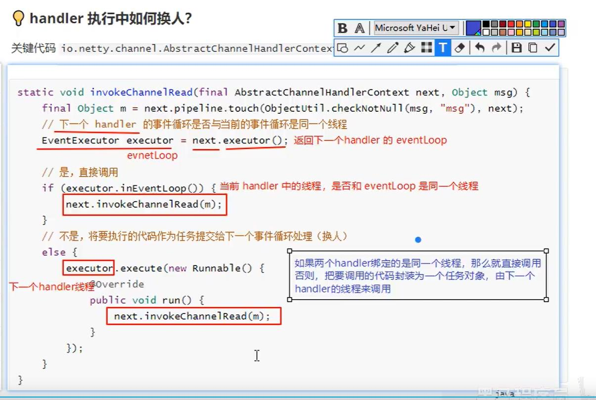
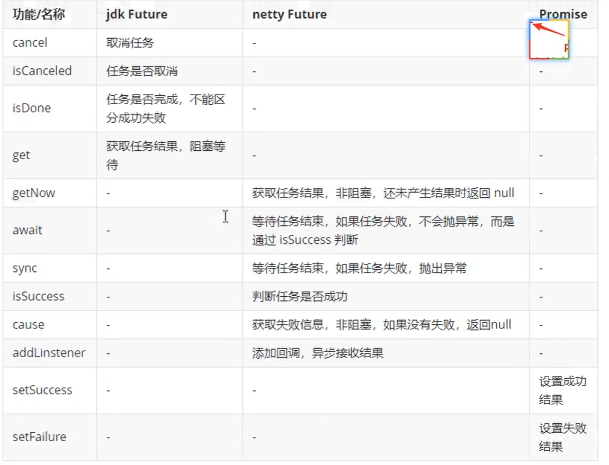
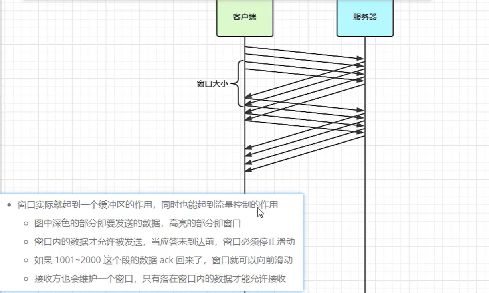
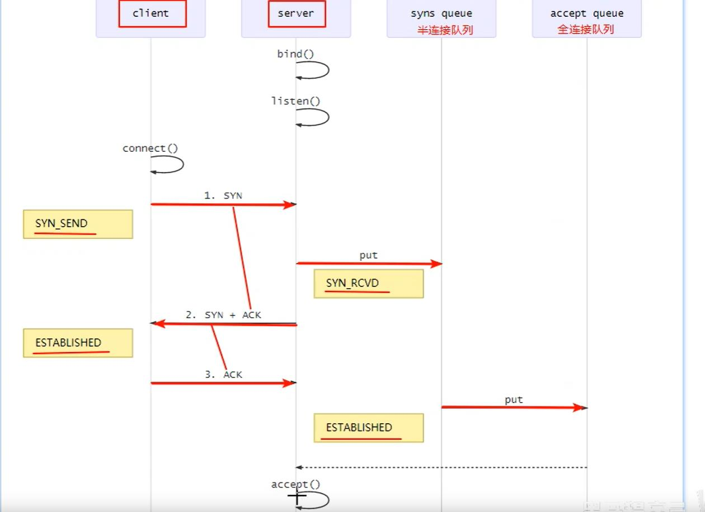
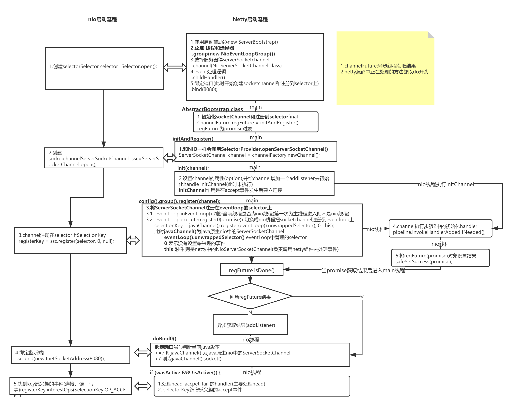
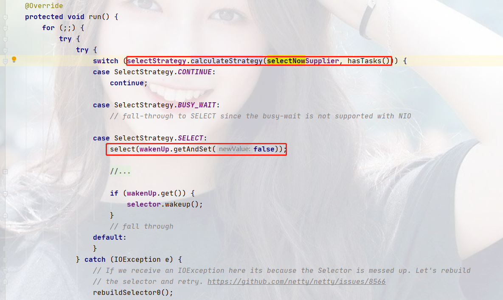
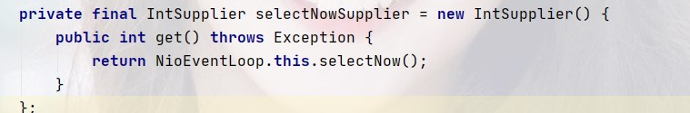

# netty Tips

### 基本概念
1. channel=数据的通道
2. msg=流动得数据
3. handler=处理数据得工序 可以多个handler处理一条msg 分成inbound(入栈) 和 outbound(出栈)
4. channel 属性有 pipeline=流水线   由多个handler组成
5. pipeline负责发布事件(读写等)传播给每个handler，handler对感兴趣得事件进行处理
6. NioEventLoop=处理数据的工人(创建新的线程去处理)
7. NioEventLoop里有selector 管理多个channel ,NioEventLoop和channel会有绑定
8. NioEventLoop可以进行任务处理(执行io操作)，拥有任务队列 队列里可以堆放多个channel得待处理任务 可以分普通任务和定时任务

9. NioEventLoop 对对应的channel得处理 可以根据pipeline顺次序去处理，也可以为handler指定不同得NioEventLoop

### 流程图
10. EventLoop 和 Channel 和 Handler关系    

11. 多handler时，源码选择handler线程的逻辑    

### eventLoop
本质上是个单线程执行器(同时维护了selector),里面有run方法处理channel上源源不断得io事件
 1. 继承juc ScheduledExecutor 故包含了线程池中所有得方法
 2. 继承 netty 得 OrderedEventExecutor 有序得
```java
    public class CompactEventLoop {
        //一.EventLoop
        //1.本质上是个单线程执行器(同时维护了selector),里面有run方法处理channel上源源不断得io事件
        //1.1 继承juc ScheduledExecutor 故包含了线程池中所有得方法
        //1.2 继承 netty 得 OrderedEventExecutor 有序得
        //二.EventLoopGroup
        //1. 一组EventLoop channel一般会调用register方法注册在一个eventloop 进行绑定 保证了一个线程处理io 数据安全
        public static void main(String[] args) {
            Logger logger = LoggerFactory.getLogger(CompactEventLoop.class);
            //1.创建事件循环组
            // 1.1 NioEventLoopGroup（io 事件 ，普通任务 定时任务） DefaultEventLoopGroup（普通任务 定时任务）
            EventLoopGroup group=new NioEventLoopGroup(2);//参数：线程数 1或者默认为cpu得核心线程数*2得最大值
            //System.out.println(NettyRuntime.availableProcessors());
            //2.获取下一个事件循环对象(轮询)
            System.out.println("group.next() = " + group.next());//group.next() = io.netty.channel.nio.NioEventLoop@5f8ed237
            System.out.println("group.next1() = " + group.next());//group.next1() = io.netty.channel.nio.NioEventLoop@2f410acf
            System.out.println("group.next2() = " + group.next());//group.next2() = io.netty.channel.nio.NioEventLoop@5f8ed237
            System.out.println("group.next3() = " + group.next());//group.next3() = io.netty.channel.nio.NioEventLoop@2f410acf
            //3.执行普通的任务 类似异步任务
            group.next().execute(()->{
                logger.debug("普通任务执行："+Thread.currentThread().getName());
            });
            //4.定时任务
            group.next().schedule(()->{
                logger.debug("延迟任务执行："+Thread.currentThread().getName());
            },1, TimeUnit.SECONDS);
            group.next().scheduleAtFixedRate(()->{
                //按时间间隔1s执行一次
                logger.debug("每秒任务执行："+Thread.currentThread().getName());
            },0,1,TimeUnit.SECONDS);
    
        }
    }
```
### netty中future的作用
启动器在添加NioEventLoopGroup,NioSocketChannel后，为channel添加handler会返回一个channelFuture，这个channelFuture就是开启Nio线程去执行连接服务器或者关闭服务器等功能返回得结果
#### 客户端的channelFuture作用

```java
public class test{
    public static void main(String[] args){
        // 带有Future,promise的都是异步方法配套使用的
        ChannelFuture channelFuture = new Bootstrap()
                .group(new NioEventLoopGroup())
                .channel(NioSocketChannel.class)
                .handler(new ChannelInitializer<NioSocketChannel>() {
                    @Override
                    protected void initChannel(NioSocketChannel nioSocketChannel) throws Exception {
                        nioSocketChannel.pipeline().addLast(new StringEncoder());
                    }
                })
                // 连接到服务器 异步非阻塞 主线程开启一个线程去连接服务器端，主线程继续执行
                .connect(new InetSocketAddress("localhost", 8080));
        //主线程无阻塞得获取channel只有地址 没有服务器端得端口和客户端端口   连接服务器端得线程并未连接上
        Channel localhost = channelFuture .channel();//为空
        //解决方法 1：
        //所以需要 阻塞主线程  直到nio线程连接建立
        Channel localhost = channelFuture.sync().channel();
        //解决方法 2 addListener(回调对象) 获取异步结果：
                channelFuture.addListener(new ChannelFutureListener() {
                    @Override
                    //在nio线程建立好之后 会调用该方法
                    public void operationComplete(ChannelFuture cf) throws Exception {
                        Channel channel = cf.channel();
                        System.out.println(localhost);
                        channel.writeAndFlush("helo");
                    }
                });
}
}
```

#### 关闭客户端连接
```java
public class test{
    public static void main(String[] args){
      //关闭客户端连接 Channel.close()是异步方法
              //解决方案1：closeFuture().sync()方法
              channel.closeFuture().sync();
              System.out.println("关闭客户端");
              //解决方案2：closeFuture().addListener
              channel.closeFuture().addListener(new ChannelFutureListener() {
                  @Override
                  public void operationComplete(ChannelFuture channelFuture) throws Exception {
                      //优雅的关闭：不接受新的任务 把现有任务执行完停止正在运行的线程
                      nioEventLoopGroup.shutdownGracefully();
                      System.out.println("关闭客户端");
                  }
              });
    }
}
        
```

#### jdk Future 和 netty Future 和 netty promise 的联系和区别
1. netty promise 继承 netty Future  继承 jdk Future
1. jdk Future只能同步等待任务结束获取返回值
2. netty Future 可以同步或异步得到结果 但都是需要等任务结束 主线程不会阻塞
3. netty promise 拥有netty Future的功能 并且脱离了任务独立存在 只作为两个线程中传递的容器    


#### handler 和 pipeline (NettyPipeline.class)
n个handler组成一个pipeline

channelHandler分为出站(如果是channel的write则从尾部，ChannelHandlerContext写入则从当前节点)和入站

pipeline的执行顺序是 head-->addlast-->tail
1. 如果是入栈（ChannelInboundHandlerAdapter）则按照正常的顺序   head-->h1-->h2-->tail
2. 如果是出栈（ChannelOutboundHandlerAdapter）则按照相反的顺序   head-->h4-->h3-->tail
3. 进出栈一起（ChannelInboundHandlerAdapter和ChannelOutboundHandlerAdapter）则按照相反的顺序   head-->h1-->h2-->h4-->h3-->tail


#### ByteBuf
1. 创建ByteBuf   
ByteBuf byteBuf= ByteBufAllocator.DEFAULT.buffer();
2. 默认使用的是直接内存,系统内存减少拷贝次数，读写性能高，配合池化功能一起使用，且不受gc影响 要注意手动释放
3. 池化和非池化   
池化的意义是可以重用ByteBuf,没有池化会每次创建都在直接内存 代价昂贵，默认使用池化功能 

组成
1. 读指针 
1. 写指针
1. 容量
1. 最大容量

区域
1. 废弃区域 读指针到起始位置 
1. 可读区域 读指针到写指针之间

和ByteBuffer不同点：
1. 动态扩容
2. 有读写指针 不需要像ByteBuffer一样切换读写模式
3. 节约内存 减少内存溢出
4. 支持链路调用 
5. 有很多支持zero-copy的方法

回收：ByteBuf实现ReferenceCounted接口
1. 每个ByteBuf对象的初始计数为1
2. 调用release方法建议 如计数为0 则会回收
3. 调用retain方法计数加1，表示在调用者还没用完之前，其他handler即使调用了release也不会造成回收
4. 如果计数为0，底层内存会回收 

方法
1. slice(起始位置,长度):将ByteBuf切割 零拷贝 切割出来的使用的源地址    
```java
public class ByteBufTest {
    public static void main(String[] args) {
        Logger logger = LoggerFactory.getLogger(ByteBufTest.class);
        ByteBuf buffer = ByteBufAllocator.DEFAULT.buffer();
        buffer.writeBytes("helloworld".getBytes());
        ByteBuf slice1 = buffer.slice(0, 5);
        ByteBuf slice2 = buffer.slice(5, 5);
        logger.debug(slice1.toString(Charset.defaultCharset()));//16:51:32.870 [main] DEBUG netty.z03.NettyPipeline - hello
        logger.debug(slice2.toString(Charset.defaultCharset()));//16:51:32.871 [main] DEBUG netty.z03.NettyPipeline - world
        //修改切片1的索引为3的字符改成b 如打印的helboworld 则证明使用的是同一个地址
        slice1.setByte(3,'b');
        logger.debug(buffer.toString(Charset.defaultCharset()));//16:51:32.871 [main] DEBUG netty.z03.NettyPipeline - helboworld
        //如果清空buffer内存 则打印切片出来的slice会报错
        //解决方案:将需要访问的slice 的计数器+1 即使释放原buf 也可以继续访问该切片
        slice1.retain();
        buffer.release();
        logger.debug(slice1.toString(Charset.defaultCharset()));//16:54:54.964 [main] DEBUG netty.z03.NettyPipeline - helbo
        logger.debug(slice2.toString(Charset.defaultCharset()));
        slice1.release();

    }
}
```
2. duplicate(): 截取原ByteBuf的所有内容且没有最大容量限制，零拷贝 用的原来地址 只是读写指针不同
3. copy() :深拷贝 新开辟地址空间

### netty中的粘包和半包出现场景和解决方案(z04/NianBaoBanBaoServer.class,NianBaoBanBaoClient.class)
1. 现象   
    粘包 ->客户端分10批发送16个字节 而服务端只接受了一次160个字节   
    原因   
    ->接收方得ByteBuf设置太大(netty默认1024)   
    ->滑动窗口，窗口过大并且接收方响应慢 报文会缓存在滑动窗口造成粘包  
    ->Nagle算法：凑够了一定大小得消息在发送  
    半包 -> 客户端分10批发送16个字节 而客户端只接受了5次 但是每一次字节数都不和我们客户端发送得字节数匹配   
    原因   
        ->接收方得ByteBuf设置太小(小于实际发送量)
        ->滑动窗口，当前窗口剩余字节数小于信息发送量，只会传一部分
        ->MSS限制：消息数据超过MSS限制(1500个字节)，会将数据切分  
2. 导致原因   
是因为Tcp是流式协议,且消息无边界

3. Tcp滑动窗口概念   
Tcp是可靠得传输协议，需要等待ack确认，引入了一种滑动窗口的概念   


4. 解决方法  
短链接方法(客户端每次发送消息结束，关闭连接)：可以解决粘包但是没办法解决半包  
消息定长方法(不够定长则补特定字符)：浪费性能 handler new FixedLengthFrameDecoder()   
根据特定字符:  
根据特定规则  
```java
package netty.z04;
public class LengthFieldBasedFrameDecoderTest {
   
    public static void main(String[] args) {
        //LengthFieldBasedFrameDecoder 处理
        //  private final int lengthFieldOffset; 长度偏移量
        //  private final int lengthFieldLength; 内容长度
        //  private final int lengthAdjustment;中间如果遇到其他长度字节写入 则需要把长度放入此参数
        //   private final int initialBytesToStrip; 结果需不需要剥离
        EmbeddedChannel embeddedChannel=new EmbeddedChannel(
                new LengthFieldBasedFrameDecoder(1024,4,0,0,0)
                ,new LoggingHandler(LogLevel.DEBUG));
        ByteBuf buf= ByteBufAllocator.DEFAULT.buffer();
        byte[] bytes="hello,zz".getBytes();
        int length = bytes.length;
        buf.writeInt(length);
        buf.writeBytes(bytes);
        embeddedChannel.writeAndFlush(buf);
        ByteBuf bufz= ByteBufAllocator.DEFAULT.buffer();
        byte[] bytee="im uu".getBytes();
        int lengthee = bytee.length;
        bufz.writeInt(lengthee);
        bufz.writeBytes(bytee);
        embeddedChannel.writeAndFlush(bufz);
    }
}

```


### 协议设计和解析
handler 
httpServerCodec既是入栈也是出栈处理器


### 
心跳检测：
```java
public class ss{
main(){
nioSocketChannel.pipeline().addLast(new IdleStateHandler(读空闲事件,写空闲事件,0));
nioSocketChannel.pipeline().addLast(new ChannelDuplexHandler(){
    @Override
    public void userEventTriggered(ChannelHandlerContext ctx, Object evt) throws Exception {
    //自定义触发特殊时间
    IdleStateEvent event=(IdleStateEvent)evt;
    if(event.state()== IdleState.READER_IDLE){
          //触发事件
         }
    }
});
}
}

```

###  netty中参数
1. connect_timeout_millis 客户端建立连接时，如果指定毫秒内无法连接，会抛出timeout异常  
   客户端option（socketChannel）配置  
   服务器端 option(给serverSocketChannel配置) childOption(socketChannel)
2. SO_TIMEOUT 用于阻塞io的超时时间，例如accept，read方法等
3. SO_BACKLOG 设置全连接队列大小 (linux系统会有配置文件，两者取最小，源码中默认windows为200 linux为128) 
netty中三次握手 
先bind和listen  
然后客户端connect后进行第一次握手  
然后服务端将此次连接放在sync queue，然后与客服端进行二次握手
客服端返回三次握手，然后服务端将此放入accept queue，然后服务器端才有accept事件   

4. TCP_NODELAY 属于socketChannel(避免nage算法，无需攒一批数据发送)
5. SO_SENDBUF & SO_RCVBUF 发送方缓冲区和接收方缓冲区 (现在程序自适应 无需配置)
6. ALLOCATOR 分配BYTEBUF (DefaultChannelConfig->判断是否是安卓系统->选择池化)
7. RECV_ALLOCATOR 决定SocketChannel ByteBuf大小和使用直接内存还是堆内存

### Netty启动流程
nio和netty启动流程的异同

 
### NioEventLoop
组成
1. selector
2. 线程
3. 任务独立额

功能 
1. 处理IO事件
2. 处理普通任务和定时任务

创建
在初始化NioEventLoop的时候调用其构造方法时创建
```java
final SelectorTuple selectorTuple = openSelector();
```

### 问题：  
**1.为啥group需要两个NioEventLoopGroup?**

第二个NioEventLoopGroup是unwarppedSelector，也就是nio原生的Selector,其selectorKey是用set进行存储，遍历损耗大
第一个NioEventLoopGroup则是netty得，对原生得selectorkey修改成数组存储，方便遍历


**2.eventLoop得nio线程何时启动？**

当首次调用execute方法时  重复调用的时候不会重复启动线程(有个状态值state判断)

**3.提交普通任务的时候会不会结束selector阻塞？**
会的 当任务队列有任务的时候会唤醒selector

**4.wakeup如何判断是否唤醒？**
```java @Override
    protected void wakeup(boolean inEventLoop) {
        //!inEventLoop 判断是否为nio线程
        //对atomicBoolean原子变量  wakenUp进行赋值 保证只有一个线程修改成功 减少损耗
        if (!inEventLoop && wakenUp.compareAndSet(false, true)) {
            //只有其他线程调用时会进入
            selector.wakeup();
        }
    }
```
**5.什么时候能够进入SelectStrategy.SELECT方法中？**  

1. 当没有任务的时候则会进入
2. 有任务的时候会调用selectNow（获取当前的任务队列）顺便拿到io事件  


**6.何时会select阻塞？阻塞多久？**  
Netty中调用Selector.select(timeoutMillis)当超过超时时间时会停止阻塞继续执行
1. 截止时间（selectDeadLineNanos）=当前时间+1s
2. 超时时间(timeoutMillis)=1s+0.5ms
  
结束阻塞条件：
1. 超时时间到了
2. 有任务
3. 有事件


**7.如何解决selector空轮询问题？**  
SELECTOR_AUTO_REBUILD_THRESHOLD有个阈值(512)空轮询次数达到512则触发重新生成selector 替代旧的


**8.ioRadio控制什么？为什么默认是100？**  
为了控制io事件所占用的时间比例
```java
                final int ioRatio = this.ioRatio;
                if (ioRatio == 100) {
                    try {
                        processSelectedKeys();
                    } finally {
                        // Ensure we always run tasks.
                        runAllTasks();
                    }
                } else {
                    final long ioStartTime = System.nanoTime();
                    try {
                        //处理所有的事件  读写连接等
                        processSelectedKeys();
                    } finally {
                        //获得执行io事件所用的时间
                        final long ioTime = System.nanoTime() - ioStartTime;
                        //运行普通任务的方法 如果时间超过限制，则任务不处理 进入下次循环处理io时间
                        runAllTasks(ioTime * (100 - ioRatio) / ioRatio);
                    }
                }
```


